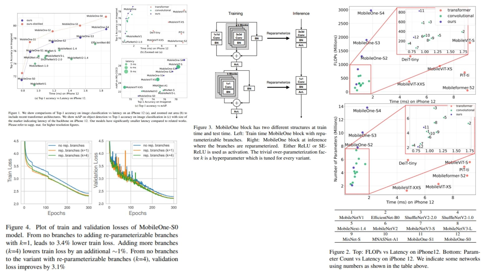

# 📱 MobileOne-Replication — Structural Re-parameterized Backbone for Ultra-Low Latency Inference ⚡

This repository provides a **faithful Python replication** of the **MobileOne architecture**, focusing on a **train-time over-parameterized design** and **inference-time structural re-parameterization into a single optimized convolutional backbone**. It follows the original paper pipeline, including **multi-branch training blocks, identity mappings, batch normalization fusion, and deployment-time graph collapsing**.

Paper reference: *MobileOne: An Improved One millisecond Mobile Backbone* https://arxiv.org/abs/2206.04040  

---

## Overview 🪶



> The architecture is built on a key principle: **use rich multi-branch representations during training, then collapse them into a single efficient operator for inference without accuracy loss**.

Instead of optimizing only FLOPs, MobileOne directly targets **real hardware latency**, reducing memory access cost and eliminating runtime branching overhead.

Key points:

-  Train-time blocks consist of parallel convolution branches + optional identity path  
-  Over-parameterization is controlled via $$k$$ parallel branches per block  
-  Depthwise + pointwise convolution design ensures efficiency on mobile devices  
-  BatchNorm is analytically fused into convolution during inference  
-  All branches collapse into a single convolution kernel at deployment time  

---

## Core Math 📐

**BatchNorm fusion into convolution:**

$$
W' = W \cdot \frac{\gamma}{\sqrt{\sigma^2 + \epsilon}}
$$

$$
b' = \beta - \mu \cdot \frac{\gamma}{\sqrt{\sigma^2 + \epsilon}}
$$

**Multi-branch aggregation (train-time):**

$$
y = \sum_{i=1}^{k} f_i(x) + f_{id}(x)
$$

**Inference-time re-parameterization:**

$$
f_{\text{fused}}(x) = f_{\text{single-conv}}(x)
$$

---

## Why MobileOne Matters 🪶

*  Designed around **real device latency**, not only FLOPs  
*  Eliminates memory access bottlenecks via single-path inference graphs  
*  Uses structural re-parameterization to decouple training and inference complexity  
*  Suitable for mobile, edge, and real-time vision systems  

---

## Repository Structure 🏗️

```bash
MobileOne-Replication/
├── src/
│   ├── blocks/
│   │   ├── conv_bn.py
│   │   ├── depthwise_conv.py
│   │   ├── pointwise_conv.py
│   │   └── identity_bn.py
│   │
│   ├── modules/
│   │   ├── mobileone_block.py
│   │   ├── mobileone_reparam.py
│   │   └── stage_builder.py
│   │
│   ├── model/
│   │   └── mobileone.py
│   │
│   └── config.py
│
├── images/
│   └── figmix.jpg
│
├── requirements.txt
└── README.md
```

---

## 🔗 Feedback

For questions or feedback, contact:  
[barkin.adiguzel@gmail.com](mailto:barkin.adiguzel@gmail.com)
